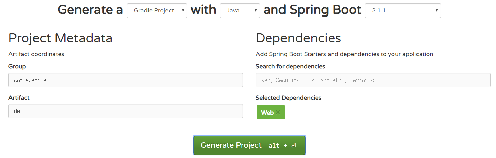
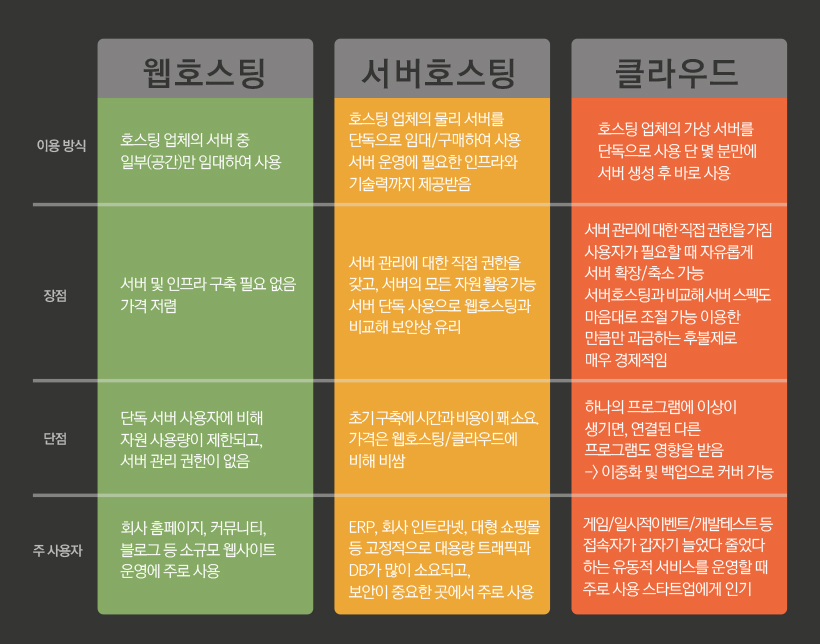

* 말이 빨라지거나 발음이 안좋아지면 말해주세요


## 목표

기초적이지만 완전히 동작하는 서비스 구축

즉, 제한적인 환경(로컬)이 아닌 실제로 인터넷에서 접근이 가능한 서비스를 만들어 보자


## 1. 스프링 프로젝트 생성

### 인텔리J STS에서 프로젝트 생성

우리는 인텔리j를 쓰는데 유료 버전에서만 가능하다.

### start.spring.io

스프링 부트에서 프로젝트를 간단히 만들어주는 사이트가 있다.

https://start.spring.io/




## 2. 기능 구현

구현하고 싶은 기능을 구현한다.

## 3. 로컬에서 실행

./gradlew build

./building/lib 디렉터리에 톰캣이 내장된 jar파일 생성

이 파일을 실행하면 로컬 서버가 동작하게 된다.


## 4. 원격 서버에 배포(실습)

https://github.com/NightNineNeighbor/distribute_example 을 fork한다.

포트 번호를 변경하고, index.hbs를 수정해 보자.


쉘로 접근한다

* mac & window power shell

> ssh nnn@192.168.x.x

* 또는 putty로 접근한다.


해당 디렉터리에 clone를 한 후

gradlew로 빌드한 후 실행시켜 본다.


#### 자동 배포 스크립트

쉘 스크립트는 한 줄 한 줄 쉘 명령어를 실행하는 파일이다.

자동으로 git pull을 하고 빌드를 한 후 서버를 실행하는 쉘을 작성해 주자.(여기에 서버가 실행되고 있을지도 모르니 서버가 작동중이라면 끄는 스크립트도 작성하자.)

```sh
1 #! /bin/bash
2 APPLICATION_NAME=demo
3 
4 SCRIPTPATH=$( cd "$(dirname "$0")" ; pwd -P )
5 echo "sh파일 실행 위치 $SCRIPTPATH"
6 
7 echo "> Git pull"
8 
9 git pull
10 
11 echo "> Build project"
12 
13 ./gradlew build
14 
15 CURRENT_PID=$(pgrep -f demo)
16 
17 echo "$CURRENT_PID"
18 
19 if [ -z $CURRENT_PID ]; then
20     echo "> 현재 구동중인 애플리케이션이 없으므로 종료하지 않습니다."
21 else
22     echo "> kill -2 $CURRENT_PID"
23     kill -2 $CURRENT_PID
24     sleep 5
25 fi
26 
27 echo "> 새 어플리케이션 배포"
28 
29 JAR_NAME=$(ls $SCRIPTPATH/build/libs |grep 'demo' | tail -n 1)
30 
31 echo "> JAR Name: $JAR_NAME"
32 
33 chmod 755 $SCRIPTPATH/build/libs/$JAR_NAME
34 nohup java -jar $SCRIPTPATH/build/libs/$JAR_NAME &
```

참고 https://jojoldu.tistory.com/263?category=635883


**4~5** : 절대경로 획득

`$0 `

명령 라인에서 실행 시 쉘명
스크립트에서 실행 시 실행된 쉘 스크립트 경로를 포함한 파일명

**15~25** : 서버가 실행되고 있을 때 서버 중지

`pgrep` 정규식으로 process id를 획득 

**29** jar파일 알아내기

여기서 파이프라인이 쓰인다. 리눅스의 장점 중 하나.

* ls : 파일 리스트
* grep : 패턴에 맞는 파일 출력
* 끝에서 n개의 출력만 출력

**33** : 쉘스크립트로 실행하면 실행 권한이 주어지지 않는다. 권한을 설정해 준다.

**34** : 터미널이 종료되어도 서버가 실행되도록 한다.

> 프로세스 중단(hangup)을 무시하고 명령어를 실행하는 명령어[1]
> 즉, 프로그램을 데몬 처럼 실행하고 싶은 경우 "명령어 &"를 사용하면 되지만 로그아웃 후에도 종료 없이 실행하고 싶은 경우
> 표준출력을 nohup.out(또는 다른 곳)으로 돌림
>
> https://zetawiki.com/wiki/%EB%A6%AC%EB%88%85%EC%8A%A4_nohup_%EC%82%AC%EC%9A%A9%EB%B2%95


## VPC(Virtual Private Cloud) 이용




클라우드 방식 호스팅에는 AWS ec2  마이크로소프트 azure등이 있다.

aws는 앞으로 쓸테니까 또 다른 vultr에서 실습을 해보자(내가 vultr이 익숙하기도 하다.)


#### DNS 설정

도메인 호스팅 사이트에서 도메인을 등록한다.

예 ) https://www.hosting.kr/